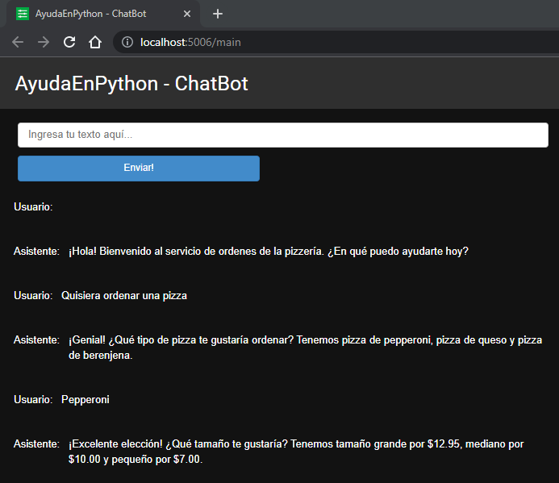

# ChatBot

Una alternativa al ejemplo de ChatBot del curso [ChatGPT Prompt Engineering for Developers](../../cursos/chatgpt-prompting-engineering/) si no usas _notebooks_ ([I don't like notebooks - Joel Grus](https://www.youtube.com/watch?v=7jiPeIFXb6U)) o si lo haces ([I Like Notebooks - Jeremy Howard](https://www.youtube.com/watch?v=9Q6sLbz37gk)) pero quieres más control.



Clona el repositorio (o haz un _fork_) y luego crea un entorno virtual:
```bash
python -m venv .venv
```

Activa el entorno virtual:
```bash
.venv\scripts\activate
```

Instala bibliotecas requeridas:
```bash
pip install -r requirements.txt
```

Crea el fichero `.env` y guarda la clave API de `openai`:
```bash
OPENAI_API_KEY="sk-..."
```

Por último, ejecuta:
```bash
panel serve main.py
```

---

> _**NOTA**_: Los usuarios de prueba gratuitos tiene un límite de 3 solicitudes por minuto. Para más información puedes consultar [aquí](https://platform.openai.com/docs/guides/rate-limits).
