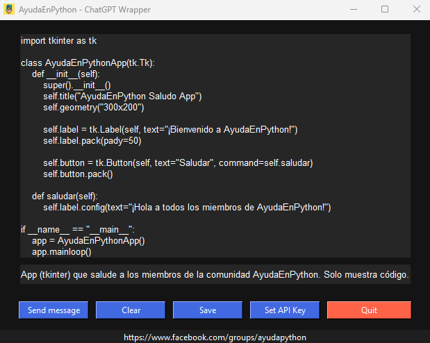

# ChatGPT Wrapper

Wrapper de GTP (`tkinter`)

## Instalación

- Clona el repositorio (o haz un _fork_)
- Abre un terminal y dirígete al directorio `apps/tkinter_chatgpt_wrapper`
- Ejecuta `python main.py`
- (Opcional) Personaliza ciertos aspectos de la aplicación con `config.ini`

## Uso

- Establece la clave API de openai con el botón `Set API Key`
- Ingresa tu _prompt_, como se muestra en la imagen superior, y presiona `Enter` o pulsa el botón `Send message`
- Espera un momento a que se genere la respuesta y sea mostrada
- (Opcional) Guardar la respuesta como un archivo ("\*.\*", "\*.py", " \*.md", "\*.txt", etc) con el botón `Save`

---

> _**NOTA**_: Los usuarios de prueba gratuitos tiene un límite de 3 solicitudes por minuto. Para más información puedes consultar [aquí](https://platform.openai.com/docs/guides/rate-limits).
